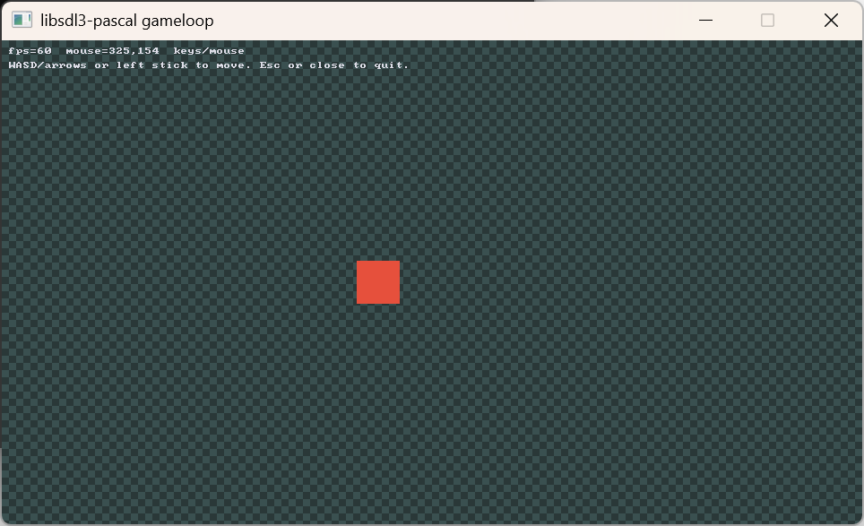
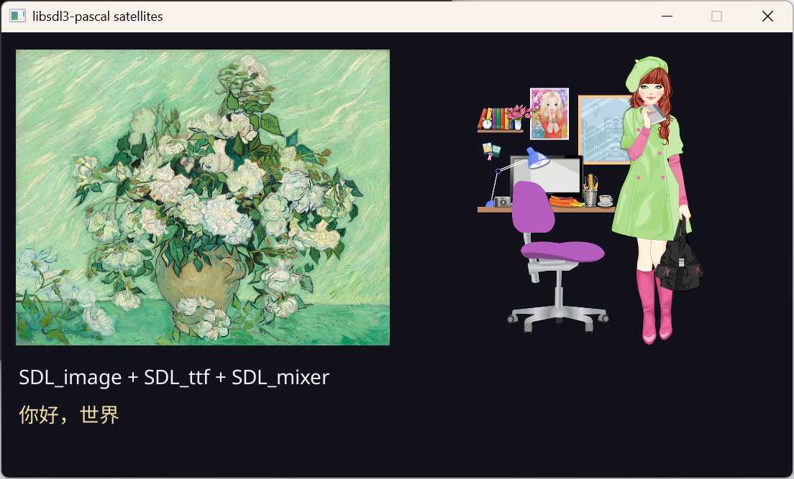
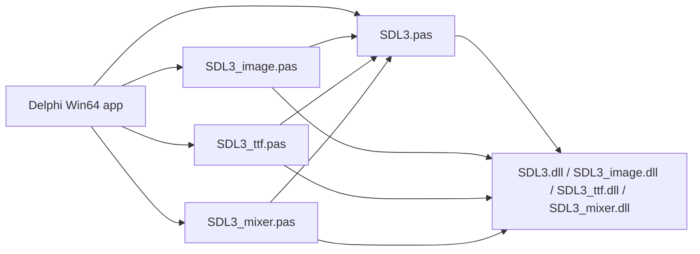

# libsdl3-pascal

1-to-1 Pascal bindings for [Simple DirectMedia Layer 3](https://www.libsdl.org/).

**v1.1.0** binds SDL **3.4.14** plus optional satellites for **Delphi 11+ Win64**. This library translates the C APIs. It does not add classes, `string` helpers, or a game engine. Applications write `uses SDL3` (and `SDL3_image` / `SDL3_ttf` / `SDL3_mixer` if needed) and call the C names (`SDL_Init`, `IMG_LoadTexture`, `TTF_OpenFont`, `MIX_PlayTrack`, …).

Step-by-step setup: [docs/GETTING-STARTED.md](docs/GETTING-STARTED.md).

## Examples

`examples/gameloop` — timestep, WASD / arrows / gamepad, generated texture:



`examples/satellites` — JPEG, PNG, Latin and Chinese text, looping MP3:



Also see `examples/hello` (window + quit), `examples/draw` (clear + rectangle), and `tests/abi` (`SDL_Event` must be 128 bytes on Win64).

## Architecture

One Pascal unit per C library. Satellites `uses SDL3` and link their own DLL. A later game engine can sit on top of these units; it is not part of this repository.



| Unit | Upstream | Pin | DLL |
|---|---|---|---|
| `SDL3` | [SDL](https://github.com/libsdl-org/SDL) | **3.4.14** | `SDL3.dll` |
| `SDL3_image` | [SDL_image](https://github.com/libsdl-org/SDL_image) | **3.4.4** | `SDL3_image.dll` |
| `SDL3_ttf` | [SDL_ttf](https://github.com/libsdl-org/SDL_ttf) | **3.2.2** | `SDL3_ttf.dll` |
| `SDL3_mixer` | [SDL_mixer](https://github.com/libsdl-org/SDL_mixer) | **3.2.4** | `SDL3_mixer.dll` (`MIX_*`, not SDL2 `Mix_*`) |

GPU device APIs stay out (`SDL_CreateGPURenderer`, `IMG_LoadGPUTexture*`, TTF GPU text engine).

## Getting started (short)

1. Add `libsdl3-pascal\src` to the Delphi search path (units and includes).
2. `uses SDL3`. On Windows call `SDL_SetMainReady` before `SDL_Init`.
3. Put official `SDL3.dll` **3.4.14** next to the exe. Add satellite DLLs only if you `uses` those units.
4. Compare `SDL_GetVersion` to `SDL_VERSION`. Refuse a different major, or a runtime older than the pin.

Full notes (search path, optional decoder DLLs, UTF-8 text, version checks): [docs/GETTING-STARTED.md](docs/GETTING-STARTED.md).

## Layout

```
src/SDL3.pas          core unit
src/SDL3_image.pas    optional SDL_image
src/SDL3_ttf.pas      optional SDL_ttf
src/SDL3_mixer.pas    optional SDL_mixer
src/SDL_*.inc         one include per C header
docs/GETTING-STARTED.md
docs/images/          example screenshots
examples/hello        window + quit
examples/draw         clear + filled rectangle
examples/gameloop     Delphi Win64 game-loop project
examples/satellites   JPEG/PNG + TTF + MP3 smoke
tests/abi             SizeOf checks
```

## Roadmap

Dates are not fixed. The binding stays a literal C mapping as it grows. The `{$IFDEF}` library-name split is already in each unit so later platforms do not need a redesign.

**Now (v1.1.0):** Delphi 11+ on **Windows desktop, 64-bit**.

**Next platforms** (order may change):

- **Devices:** desktop and handheld / mobile.
- **OS:** more Windows (including 32-bit once ABI is re-checked), macOS, Linux, Android, iOS.
- **Architecture:** x86, x64, and ARM (including Windows ARM64 and Apple Silicon).
- **Compilers:** Free Pascal / Lazarus after a Win64 smoke, then the same units on the OS list above.

Each new OS or architecture needs its own C ABI check (`sizeof` / packing can differ) and a real official binary before we claim it.

**Later APIs** (still out of this tag): `SDL_gpu` and the GPU-only image / TTF entry points, camera, haptic, hidapi, `SDL_net`, and the usual 3D / XR header dumps. A 2D game engine that `uses` these units will be a **separate** project.

## License

zlib — see [LICENSE](LICENSE). Same terms as SDL. Example media and fonts have their own licenses; see `examples/satellites/CREDITS.md`.
