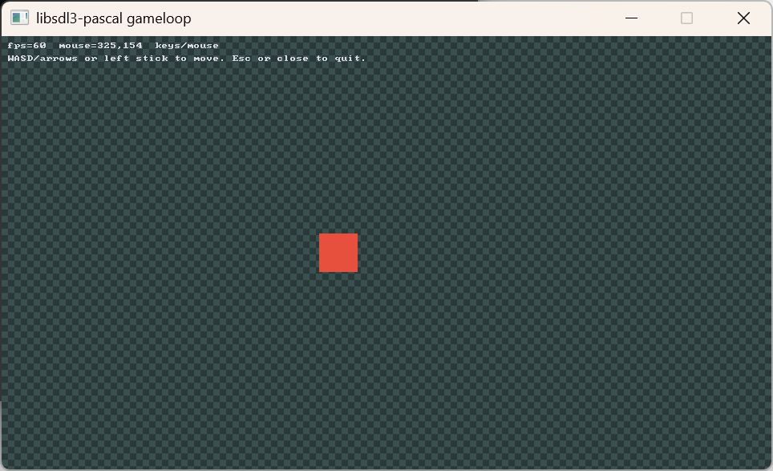

# gameloop

Win64 game loop: fixed timestep, WASD / arrows / optional gamepad, generated checkerboard texture.



Put `SDL3.dll` 3.4.16 next to the executable. From the repository root, `powershell -File tools\fetch-dlls.ps1` downloads it. Open `gameloop.dpr` in Delphi and add `libsdl3-pascal\src` to the unit and include search paths, or:

```
dcc64 "-U..\..\src" "-I..\..\src" gameloop.dpr
```
